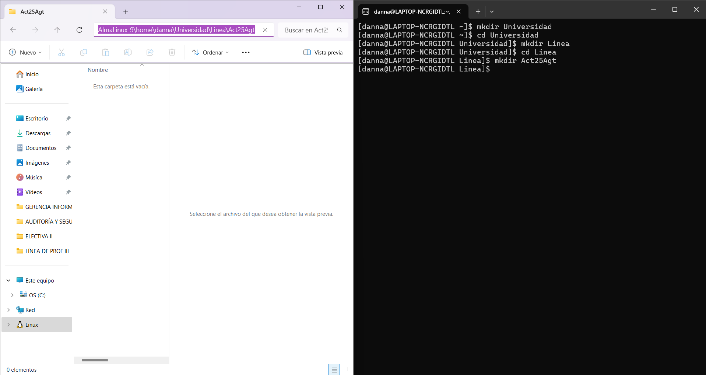
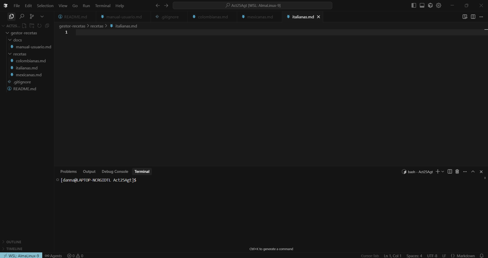
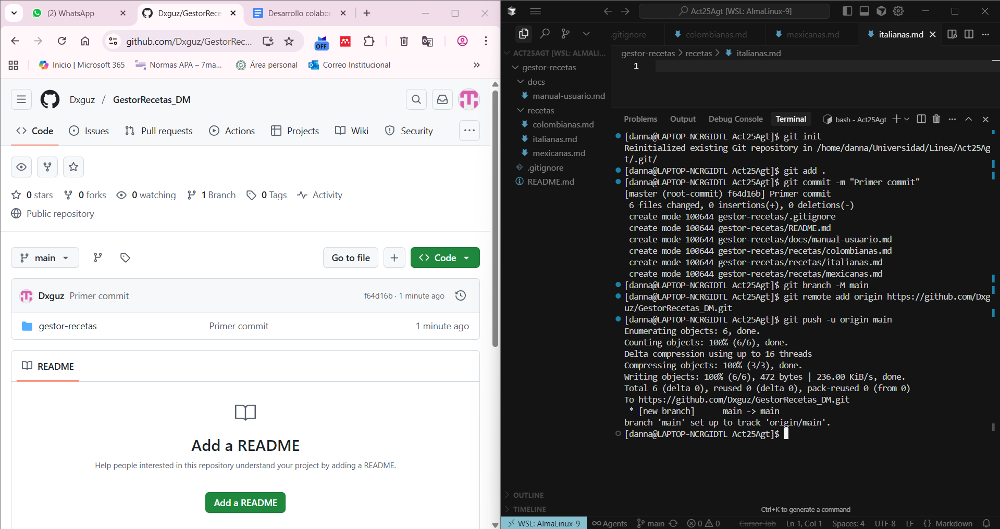
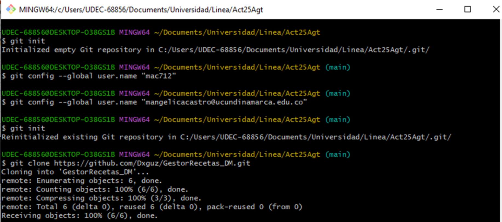
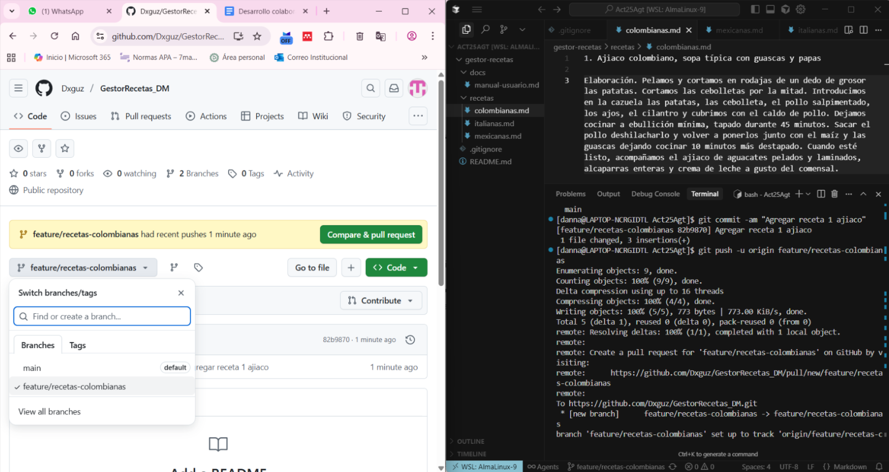
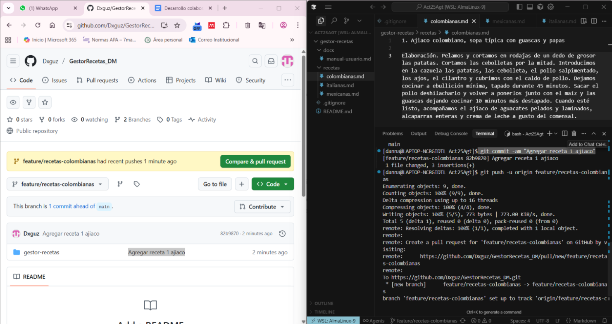
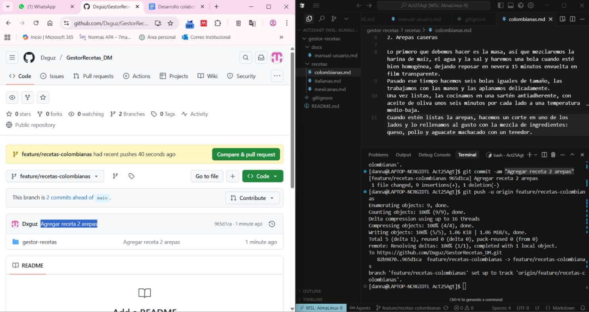
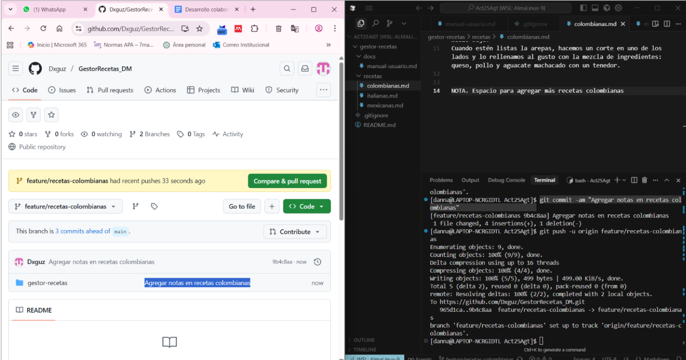
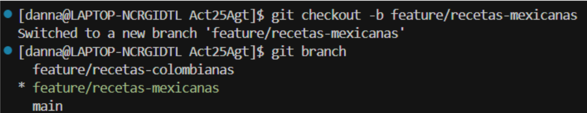

# Version de Git  2.47.1

# Taller Desarrollo colaborativo con Git y GitHub

#Integrantes:
* María Castro
* Danna Guzmán

# 1. Estructura base del repositorio
* Se crean las carpetas desde la terminal de almalinux 9

* Uso de la herramienta Cursor IA, donde se debe conectar con el WSL: Almalinux-9 y abrir un proyecto con las carpetas creadas anteriormente

# 2. Creación del repositorio

# Comandos para crear el repositorio
* git init
* git commit -m "Primer commit"
* git branch -M main
* git remote add origin https://github.com/Dxguz/GestorRecetas_DM.git
*git push -u origin main

* La estudiante 1 creó un repositorio en github y subió los archivos, con la estructura solicitada, por medio de la ejecución de comandos en la terminal.

# 3. Clonación del repositorio

# Comandos para crear el repositorio
* git init
* git clone https://github.com/Dxguz/GestorRecetas_DM.git

* La estudiante 2 aceptó la invitación de colaboradora en el repositorio, y lo clonó en la ruta que se ve en la imagen.

# 4. Creación de ramas

# 4.1. Rama feature/recetas-colombianas (Integrante Danna Guzmán)

* Commit 1 en rama feature/recetas-colombianas

* Commit 2 en rama feature/recetas-colombianas

* Commit 3 en rama feature/recetas-colombianas

# 4.2. Rama feature/recetas-mexicanas (Integrante Danna Guzmán)

* Commit 1 en rama feature/recetas-mexicanas

* Commit 2 en rama feature/recetas-mexicanas

* Commit 3 en rama feature/recetas-mexicanas

# 4.3. Rama feature/recetas-italianas (Integrante María Castro)

* Primer commit en la rama feature/recetas-italiana

* Segundo Commit en la rama feature/recetas-italiana

 
* Tercer Commit en la rama feature/recetas-italiana

# 5. Fusión mediante pull request (PR) en GitHub.

# Crear pull request 

* Seleccionar la opción Compare & pull request 

* Dar un nombre para el pull request y en la opción de reviewers seleccionar al otro integrante para que este pueda aprobar los cambios generados y así fusionarlos en la rama main.

* Registro de la solicitud de revisión

# Aprobar pull request

# 6. Conflicto intencional en el archivo recetas/colombianas.md y resolverlo correctamente. 

* Integrate 1 (Danna Guzmán)
* En la rama feature/recetas-colombianas se agrega texto en la línea 20 y se sube el cambio a github con su respectivo commit.

