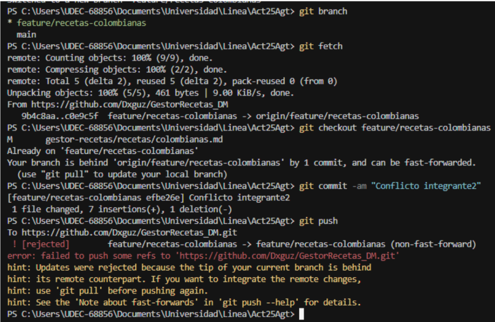

# Version de Git  2.47.1

# Taller Desarrollo colaborativo con Git y GitHub

#Integrantes:
* María Castro
* Danna Guzmán

# 1. Estructura base del repositorio
* Se crean las carpetas desde la terminal de almalinux 9

* Uso de la herramienta Cursor IA, donde se debe conectar con el WSL: Almalinux-9 y abrir un proyecto con las carpetas creadas anteriormente

# 2. Creación del repositorio

# Comandos para crear el repositorio
* git init
* git commit -m "Primer commit"
* git branch -M main
* git remote add origin https://github.com/Dxguz/GestorRecetas_DM.git
*git push -u origin main

* La estudiante 1 creó un repositorio en github y subió los archivos, con la estructura solicitada, por medio de la ejecución de comandos en la terminal.

# 3. Clonación del repositorio

# Comandos para crear el repositorio
* git init
* git clone https://github.com/Dxguz/GestorRecetas_DM.git

* La estudiante 2 aceptó la invitación de colaboradora en el repositorio, y lo clonó en la ruta que se ve en la imagen.

# 4. Creación de ramas

# 4.1. Rama feature/recetas-colombianas (Integrante Danna Guzmán)

* Commit 1 en rama feature/recetas-colombianas

* Commit 2 en rama feature/recetas-colombianas

* Commit 3 en rama feature/recetas-colombianas

# 4.2. Rama feature/recetas-mexicanas (Integrante Danna Guzmán)

* Commit 1 en rama feature/recetas-mexicanas

* Commit 2 en rama feature/recetas-mexicanas

* Commit 3 en rama feature/recetas-mexicanas

# 4.3. Rama feature/recetas-italianas (Integrante María Castro)

* Primer commit en la rama feature/recetas-italiana

* Segundo Commit en la rama feature/recetas-italiana

 
* Tercer Commit en la rama feature/recetas-italiana

# 5. Fusión mediante pull request (PR) en GitHub.

# Crear pull request 

* Seleccionar la opción Compare & pull request 

* Dar un nombre para el pull request y en la opción de reviewers seleccionar al otro integrante para que este pueda aprobar los cambios generados y así fusionarlos en la rama main.

* Registro de la solicitud de revisión

# Aprobar pull request

# 6. Conflicto intencional en el archivo recetas/colombianas.md y resolverlo correctamente. 

* Integrante 1 (Danna Guzmán)
* En la rama feature/recetas-colombianas se agrega texto en la línea 20 y se sube el cambio a github con su respectivo commit.

* Integrante 2 (Maria Castro)
*En la rama feature/recetas-colombianas se agrega texto también en la línea 20 y se sube el cambio a github con su respectivo commit, y así se evidencia el error ya que anteriormente se han hecho cambios en esta sección.

* Para resolver el conflicto, se hace un git pull y luego se edita el archivo manualmente, eliminando los marcadores de conflicto y manteniendo la información que sea realmente necesaria.

* También se puede solucionar el conflicto desde GitHub.

* Una vez eliminada la información innecesaria, se genera un último commit con los cambios finales.

# 7. Usar .gitignore para excluir algún archivo temporal

* En el archivo .gitignore se debe anotar el nombre de los archivos que no deben subirse al repositorio, en este caso es server.log. Al aparecer sombreado levemente se indica que este archivo no estará en el repositorio.

# 8. Crear un tag v1.0.0 sobre el commit final.  

* Lista de commits hechos en el proyecto

* Verificar que el tag aparece en el repositorio

# Fin de la documentación